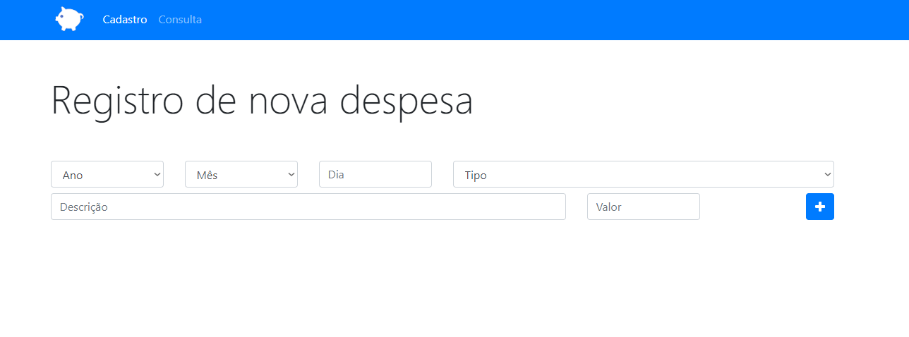

<h1 align="center"> OrçamentoDespesas </h1>

Aplicação para cadastro e consultas de despesas

Preview da página inicial (Zoom: 100%)

[Clique AQUI para acessar](https://nepht022.github.io/OrcamentoDespesas/)

## Ferramentas

- HTML
- Javascript
- Bootstrap
- Fontawesome
- Git
- Github
